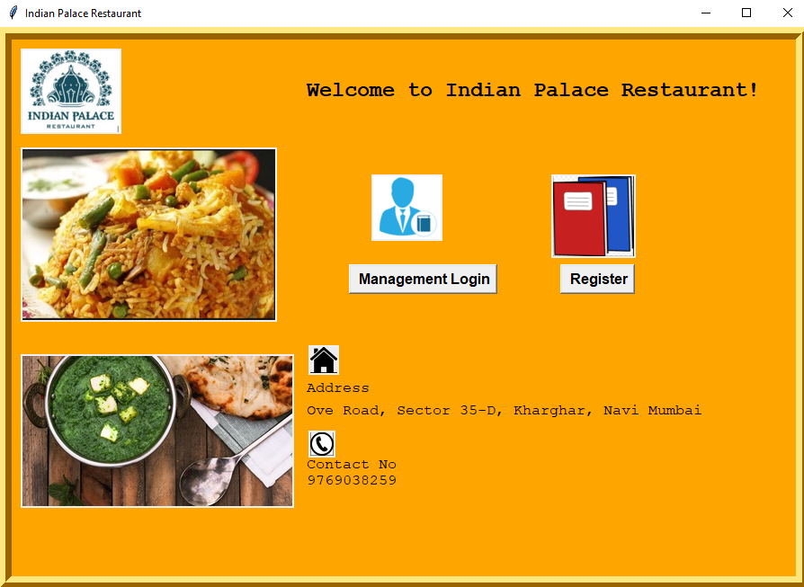
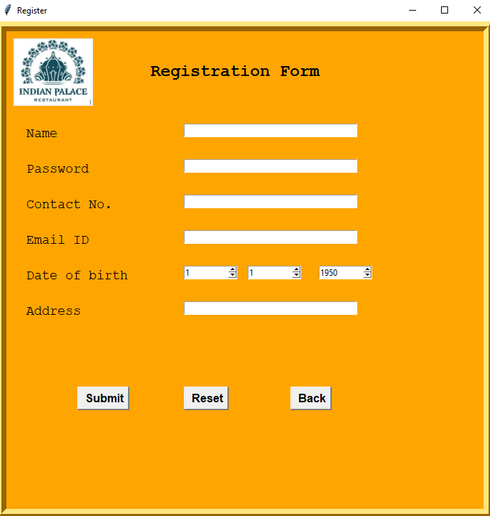
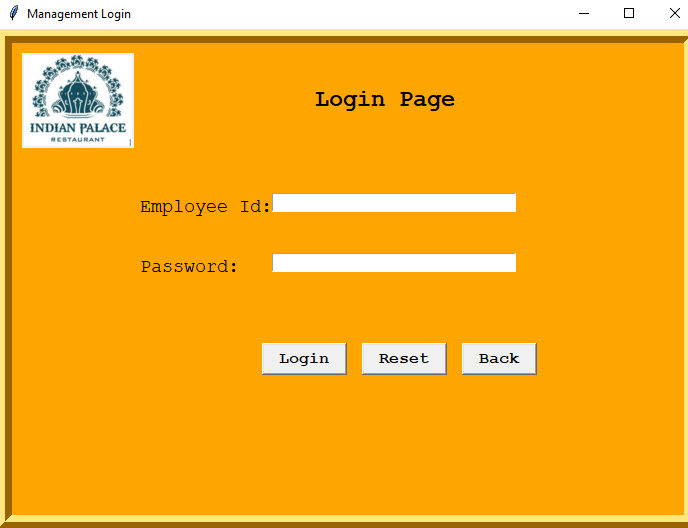
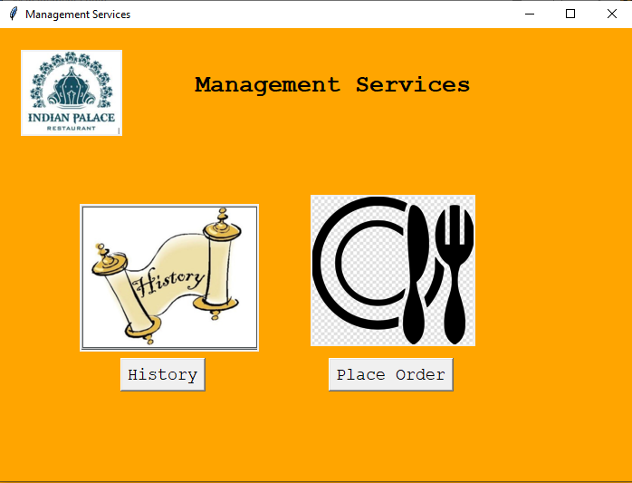
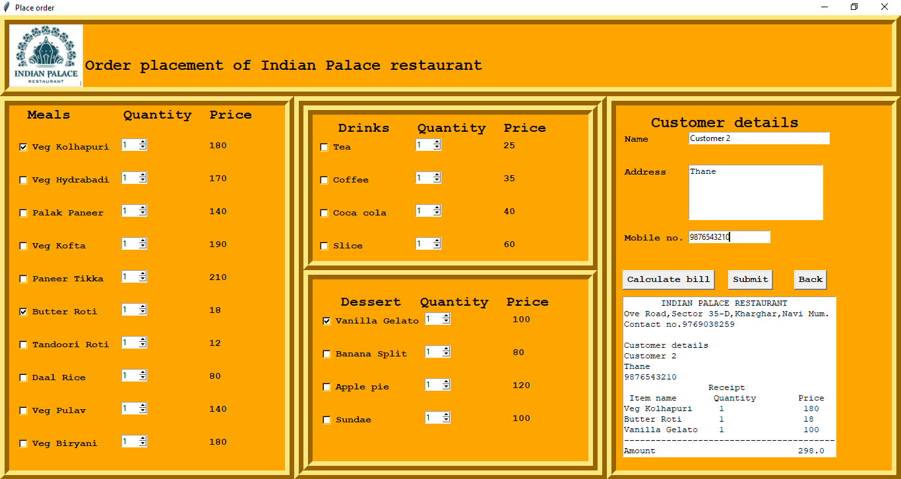
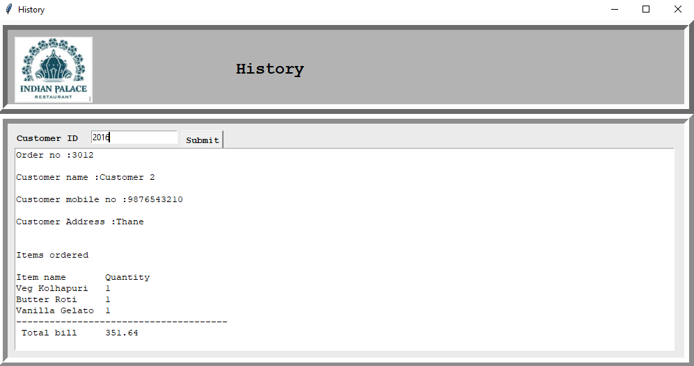

# Hotel Management System

The Hotel Management System is developed using Tkinter. It provides the following functionalities

- Staff Registration and Login
- Order Placement and Bill Generation
- Order History

# Output

- Init screen
  
   
- Registration
  
   
- Login
  
   
- Managment Servies
  
   
- Order Placement
  
   
- Order History
  
   
